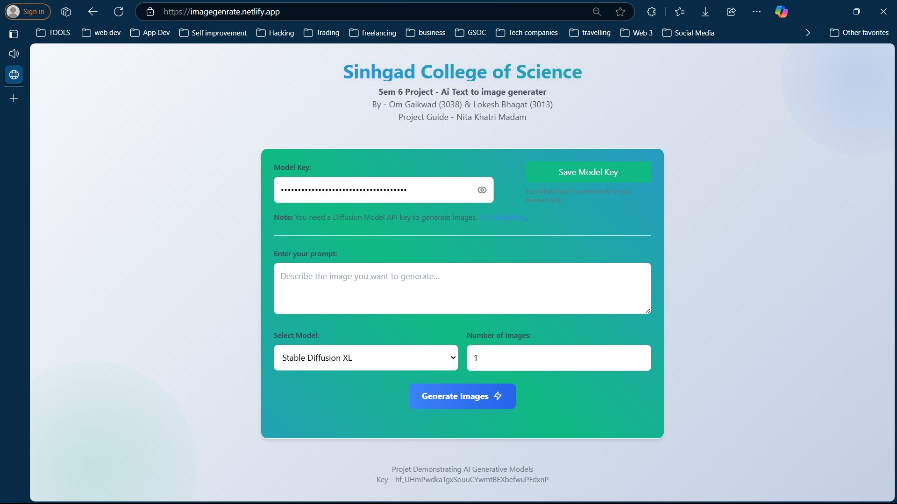

# Portfolio Website Project

Welcome to the Portfolio Website Project! This project is designed to help you create a personalized portfolio website to showcase your skills, projects, and experiences to potential employers, clients, or collaborators.

 **Check Out My Project :** [omgaikwad.tech](https://omgaikwad.tech/)

## Project Overview

The Portfolio Website Project is aimed at providing you with a platform to highlight your professional achievements and present your work in an organized and visually appealing manner. Whether you're a web developer, designer, writer, or any other professional, having a portfolio website can greatly enhance your online presence and help you stand out in your field.

</img>

## Features

1. **Responsive Design:** The website should be accessible and visually appealing across various devices and screen sizes, including desktops, laptops, tablets, and smartphones.
2. **Navigation:** Users should be able to easily navigate through different sections of the website, such as About Me, Projects, Contact, etc.
3. **Project Showcase:** Display your projects prominently, providing descriptions, images, and links to further details or live demos.
4. **About Me Section:** Introduce yourself, your background, skills, and any other relevant information.
5. **Contact Form:** Allow visitors to contact you directly through a contact form or provide alternative means of communication.
6. **Customization:** The website should be easily customizable to reflect your personal branding and style preferences.

## Technologies Used

- HTML/CSS: For structuring and styling the website.
- JavaScript: For interactivity and dynamic elements.
- Frameworks / Libraries :  Bootstrap

- Hosting: GitHub Pages and Netlify.

## Getting Started

1. **Clone the Repository:** https://github.com/gaikwadomg/portfolio.git
2. **Open index.html file**
